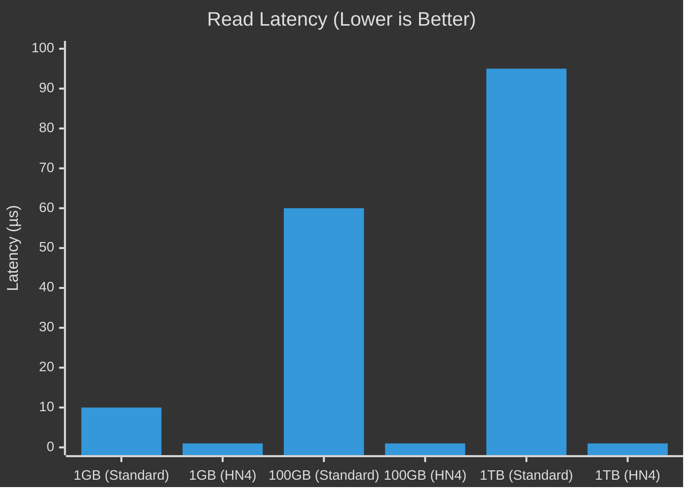

<div align="center">

# HN4
### **The Post-POSIX Filesystem.** 

<!-- Badges -->
[](https://github.com/)

[](https://opensource.org/licenses/Apache-2.0)

<br />

</div>

##### Disclaimer: Files and docs will follow throughout the day. The code will be published now. The previous implementation was tightly coupled to my OS, so I’m currently rewriting it to be platform-agnostic. Documentations is coming soon. The original build successfully runs 4K test files, and the initial source drop will be available tomorrow.

---

**HN4** is a high-velocity storage engine designed for the era of NVMe, ZNS, and direct-to-metal applications. It discards legacy assumptions (like spinning disks and inode trees) to achieve **O(1) data access** and **Zero-Copy latency**.

---

## ⚡ Why HN4? (The Physics of Speed)

Standard filesystems (ext4, NTFS, XFS) use **Trees** to manage data. To find a file block, the CPU must traverse metadata nodes.
**HN4 uses Math.** To find a block, it calculates a ballistic trajectory.

### 1. The Speed of Math (Latency)
In traditional systems, finding data is a search operation ($O(\log N)$). In HN4, it is a calculation ($O(1)$).

```c
// Standard FS (Tree Search)
Block = Root -> Node A -> Node B -> Leaf; // Latency: Microseconds

// HN4 (Ballistic Calculation)
LBA = Gravity_Center + (Velocity * N);    // Latency: Nanoseconds
```

**Benchmark Visualization: Lookup Latency vs File Size**



### 2. The "Shotgun" Protocol (Throughput)
Modern NVMe drives have 128+ hardware queues. Standard filesystems read sequentially, leaving bandwidth on the table.
HN4's **Shotgun Protocol** fires multiple trajectory requests ($k=0..3$) simultaneously across NAND channels.

```text
[ NVMe Hardware Queues ]
Standard FS:  [ R ][ . ][ . ][ . ]  (Sequential Bottleneck)
HN4 Engine:   [ R ][ R ][ R ][ R ]  (Bus Saturation)
```

---

## 🏗️ Architecture: A Paradigm Shift

HN4 is not just "faster"; it is architecturally distinct from anything in the POSIX world.

### 🌌 The Void Engine (Ballistic Allocator)
We do not scan bitmaps for free space. We calculate entropy holes.
*   **No Fragmentation:** On Flash/NVMe, scattering data maximizes parallelism.
*   **No Degradation:** Performance remains deterministic even at 99% capacity.

### 🧬 The Helix (Auto-Medic)
**Single-Drive Self-Healing.**
Most filesystems rely on RAID for repair. HN4 writes data to a primary trajectory ($k=0$) and parity/redundancy to alternate orbits ($k>0$).
*   If a block is rot/toxic, the **Auto-Medic** calculates the alternate trajectory, reads the replica, heals the primary, and returns the data—all transparently to the user.

### 🧠 Tensor Tunnels (GPU Direct)
Built for AI. HN4 supports **Direct Memory Access (DMA)** from storage directly to NPU/GPU memory, bypassing the CPU copy overhead completely via the `HN4_ALLOC_TENSOR` alignment strategy.

### ⏳ Wormholes (Time Travel)
The **Epoch Ring** is not just a journal; it is a time machine.
*   Mount the filesystem state from 5 seconds ago or 5 days ago.
*   Snapshots are lightweight pointer offsets, not heavy copy-on-write chains.

---

## 🎛️ Simplicity via Profiles

The internal math (Gravity Assist, Morton Codes, Hamming ECC) is complex. The interface is not.
The **Profile System** abstracts the physics engine into 5 distinct modes, optimizing the math for the hardware automatically.

| Profile | Target Hardware | Math Strategy ($V$) | Behavior |
| :--- | :--- | :--- | :--- |
| **PICO** | Microcontrollers (ESP32/ARM) | $V=1$ (Linear) | Minimal RAM usage. Zero-alloc streams. |
| **ARCHIVE** | HDDs / Tape | $V=1$ (Linear) | Sequential I/O. Maximizes density. No seeking. |
| **GAMING** | Consoles / NVMe | $V=17$ (Scatter) | Max random read speed. Shotgun Protocol active. |
| **AI** | GPU Clusters | $V=17$ (Scatter) | 2MB Alignment. Tensor Tunneling enabled. |
| **SYSTEM** | OS Boot Drives | Special | "Launchpad" layout. Data at LBA 0 for instant boot. |

---

## 🛠️ Integration & Usage

HN4 is written in strict **C99/C11**. It is designed for **Bare Metal** and **Kernel** environments.

### Requirements
*   No Heap Allocation (Optional)
*   No OS Dependencies (Freestanding)
*   128-bit Atomics (or software fallback)

### Example: Formatting a Drive
```c
#include "hn4.h"

// 1. Initialize the HAL (Hardware Abstraction Layer)
hn4_hal_device_t* dev = my_driver_init("/dev/nvme0n1");

// 2. Define Parameters
hn4_format_params_t params = {
    .label = "PS6_Game_Drive",
    .target_profile = HN4_PROFILE_GAMING, // Optimized for random reads
    .clone_uuid = false
};

// 3. Format (Returns O(1) success/fail)
hn4_result_t res = hn4_format(dev, &params);

if (res == HN4_OK) {
    printf("Volume formatted. Shotgun Protocol engaged.\n");
}
```

### Example: Reading a File
```c
// Open handle (Zero metadata I/O if cached)
hn4_handle_t* h = hn4_api_open(vol, "/data/level_map.bin", O_RDONLY);

// Read directly into buffer (Zero-Copy DMA)
// The engine calculates LBA = G + (V*N) and fires NVMe commands.
uint64_t bytes_read;
hn4_api_read(h, my_buffer, 1024*1024, &bytes_read);
```

---

## 📊 Comparison

| Feature | HN4 | ext4 / XFS | ZFS |
| :--- | :--- | :--- | :--- |
| **Lookup Algo** | **Math ($O(1)$)** | B-Tree ($O(\log n)$) | B-Tree ($O(\log n)$) |
| **Integrity** | **Self-Healing (Helix)** | Journaling (Metadata only) | Checksums + RAID |
| **Latency** | **Nanoseconds** | Microseconds | Microseconds |
| **Full Disk Perf** | **Deterministic** | Degrades | Degrades |
| **Directory List** | Slow (Linear Scan) | Fast (Tree Walk) | Fast (Tree Walk) |
| **OS Support** | Embedded / Custom | Linux Standard | BSD / Linux |

**Final Verdict:**
*   Use **ext4/ZFS** for general-purpose servers and desktop OSs where `ls -la` performance matters.
*   Use **HN4** for embedded systems, game consoles, AI training clusters, and high-frequency trading logs where **raw I/O latency** and **CPU efficiency** are paramount.

---

## 📜 License
Apache 2.0 — free for commercial and private use with attribution and patent grant.

---
*Built for the void.*
