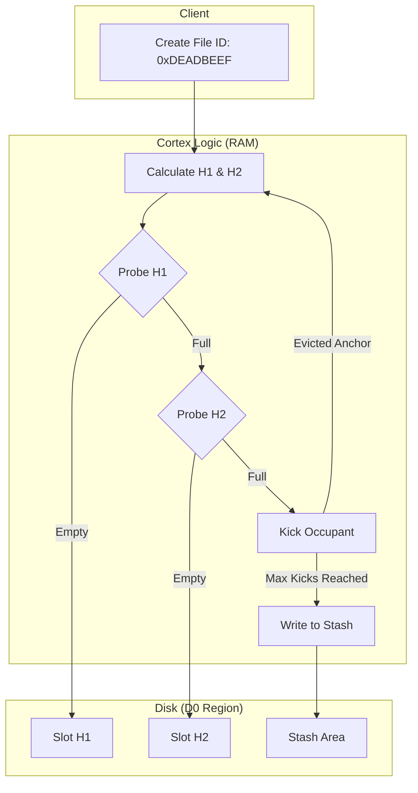

# THE ANCHOR PROTOCOL
### *The Gravitational Singularity of Data*

## 1. The Core Concept

In traditional file systems (ext4, NTFS, ZFS), a file is defined by an **Inode**. An Inode is a container of pointers. It points to block addresses, or it points to "Indirect Blocks" (trees) which then point to data. To read a file, you must traverse this tree.

**HN4 rejects the Tree.** It replaces the Inode with the **Anchor**.

An Anchor does not *point* to data. It acts as the mathematical **Seed** for the Void Engine. It defines a **Gravity Well**—a set of physical constants ($G, V, M$) that allows the CPU to calculate the location of any byte of data instantly, without disk lookups.

**Positioning Statement:**
*An Anchor is not a map of where data is. It is the equation that defines where data must be.*

---

## 2. Anatomy of an Anchor

The Anchor is a fixed-size, cache-aligned structure. It is strictly **128 Bytes** (fitting exactly into two 64-byte CPU cache lines). This compact size allows the "Nano-Cortex" (RAM cache) to store metadata for millions of files in a tiny memory footprint.

### The 128-Byte Capsule (Bit-Level Layout)

| Offset | Field | Bits | Description |
| :--- | :--- | :--- | :--- |
| **0x00** | `seed_id` | 128 | **The Physics Constant.** Immutable. Used to seed the Trajectory/Hash algorithms. |
| **0x10** | `public_id` | 128 | **The Logical Identity.** Mutable. The UUID visible to the OS. |
| **0x20** | `gravity_center` | 64 | **$G$:** The physical Starting LBA. The origin point of the trajectory. |
| **0x28** | `mass` | 64 | Logical File Size (in bytes). |
| **0x30** | `data_class` | 64 | Flags: `TOMBSTONE`, `ENCRYPTED`, `COMPRESSED`, `LUDIC` mode. |
| **0x38** | `tag_filter` | 64 | Bloom Filter for instant Tag Search (No directory walk needed). |
| **0x40** | `orbit_vector` | 48 | **$V$:** The Prime Number stride. Defines the orbital spacing. |
| **0x46** | `fractal_scale` | 16 | **$M$:** The block size power ($2^M$). 0=4KB, 10=4MB. |
| **0x48** | `permissions` | 32 | Capability Mask (Sovereign/Immutable/Append-Only). |
| **0x4C** | `sovereign_id` | 32 | Hash of the Owner's Key. |
| **0x50** | `mod_clock` | 64 | Nanosecond Timestamp of last write. |
| **0x58** | `write_gen` | 32 | **The Phantom Guard.** Increments on every Shadow Hop. |
| **0x5C** | `create_clock` | 32 | Creation Timestamp (Seconds). |
| **0x60** | `checksum` | 32 | CRC32C of the Anchor itself. |
| **0x64** | `inline_buffer` | 224 | **Immediate Data.** Holds filenames or tiny file content. |

### The Integrity Seal (Anti-Forgery)
The `checksum` (Offset 0x60) is not a simple block CRC. It is a cryptographic binding of **Identity + Physics**.
It covers `seed_id`, `gravity_center`, `orbit_vector`, `mass`, `write_gen`, and `permissions`.
*   **Result:** A "Ghost Anchor" cannot be forged by bit-flipping a deleted entry. Stale anchors cannot resurrect because their `write_gen` will mismatch the global state or the data block headers. Any modification without re-checksumming fails validation at mount or lookup.

---

## 3. The Cortex (D0): A Hash Table on Disk

Anchors are not scattered randomly. They reside in a dedicated region called **The Cortex (D0)**.
Crucially, the Cortex is not a B-Tree or a List. It is a **Deterministic Cuckoo Hash Table**.

### The Placement Logic ($O(1)$ Creation)
When `hn4_create(ID)` is called, the driver does not scan for a free slot.
1.  **Hash 1:** Calculate `H1 = Hash_A(ID) % Table_Size`.
2.  **Hash 2:** Calculate `H2 = Hash_B(ID) % Table_Size`.
3.  **The Probe:**
    *   Check Slot `H1`. If empty, Write.
    *   Check Slot `H2`. If empty, Write.
4.  **The Kick (Cuckoo Logic):**
    *   If both are full, **Kick** the occupant of `H1` to *its* alternate location (`H2`).
    *   This cascades until a free slot is found or the "Stash" (overflow area) is used.

**Result:** Finding a file takes **exactly 1 or 2 reads**, guaranteed. There is no tree traversal.

### Concurrency: The Hashed Spinlock
How do we handle 100 threads creating files simultaneously?
*   HN4 does not use a Global Lock on the Cortex.
*   It uses **Fibonacci Hashed Spinlocks** (Pool of 64-128 locks).
*   The target LBA of the Slot is hashed to index into the lock pool.
*   **Benefit:** Two threads modifying unrelated files will statistically never block each other.

### Hash Stability & The Stash
What if the Cortex fills or we hit a collision storm?
*   **Fixed Geometry:** The Cortex size is fixed at format time (typically 2% of capacity). It does not resize dynamically (preventing fragmentation).
*   **The Stash (Overflow):** If an insertion triggers `HN4_CUCKOO_MAX_KICKS` (default 16), the Anchor is placed in the **Stash Region** at the end of D0.
*   **Lookup Path:** Check H1 $\to$ Check H2 $\to$ Scan Stash. This bounds the worst-case lookup time to a small constant.



---

## 4. Dual Identity Theory (Seed vs. Public)

Why are there two IDs (`seed_id` and `public_id`)?

*   **`seed_id` (The Physics):**
    *   Generated at Genesis. **Never changes.**
    *   This ID is fed into the Ballistic Engine to calculate block locations.
    *   If you changed this, the math would break, and the file data would be lost.
*   **`public_id` (The Logic):**
    *   The UUID presented to the user/OS.
    *   **Renaming/Relinking:** You can change the `public_id` to "move" a file to a new virtual identity without moving a single byte of data. The physics (`seed_id`) remain anchored.

---

## 5. Immediate Mode (The Singularity)

For tiny files (symlinks, INI configs, scripts), allocating a 4KB block is wasteful (99% slack space) and slow (requires a second disk seek).

**The Optimization:**
*   If `mass <= 28 bytes`:
*   The data is stored **inside** the `inline_buffer` (Offset 0x64).
*   The `gravity_center` is set to `0`.
*   The `fractal_scale` is set to `0`.

**The Read Path:**
When `hn4_read()` sees `gravity_center == 0`, it acts as a **Singularity**. It serves the data directly from the Anchor metadata cache.
**Latency:** 0.00ms (Memory Copy).

---

## 6. The Fractal Scale (M)

This is the secret to HN4's scalability. Traditional filesystems are locked to 4KB blocks. This makes a 1TB file require 268 million metadata pointers (huge RAM usage).

The Anchor defines a `fractal_scale` ($M$):
$$ \text{Block Size} = 4\text{KB} \times 2^M $$

*   **Small File:** $M=0$ (4KB Blocks). Granular.
*   **Huge Database:** $M=4$ (64KB Blocks).
*   **8K Video:** $M=10$ (4MB Blocks).

**The Impact:**
A 1TB file with $M=10$ (4MB blocks) only has 262,000 "logical blocks."
The trajectory calculation remains simple. The CPU overhead drops by **1000x**.

---

## 7. The Capability Model (Permissions)

HN4 Anchors enforce physics, not just policy. The `permissions` bitmask changes the behavior of the allocator.

*   **`PERM_IMMUTABLE`:** The Void Engine physically **disables** the Write Path for this Seed ID. It is mathematically impossible to modify the file without first stripping this bit via a Sovereign Key.
*   **`PERM_APPEND`:** The Allocator will only grant trajectories for $N > N_{max}$. It refuses to calculate trajectories for existing blocks (Preventing overwrite).
*   **`PERM_ENCRYPTED`:** Signals the Read Path to pass the payload through the ChaCha20 stream cipher using the `seed_id` as the IV source.

### Sovereignty Guarantees
Security is enforced by physics, not just convention.
*   **The Checksum Domain:** The `sovereign_id` is included in the Anchor checksum.
*   **Immutable Physics:** To flip the `PERM_IMMUTABLE` bit, you must re-sign the Anchor. To re-sign, you must possess the Sovereign Key.
*   **Allocator Rejection:** The Void Engine checks permissions *before* calculating trajectories. A write to an immutable file is rejected at the math layer—no IO is ever issued.

---

## 8. Extension Chains (Beyond 128 Bytes)

What if we need to store a Long Filename (>28 chars) or Vector Embeddings (AI)? We cannot break the 128-byte Anchor limit.

**The Solution:**
The `inline_buffer` can hold a **Pointer** to an Extension Block in the D0 Extension Region.

```c
typedef struct {
    uint32_t magic;         // "META"
    uint32_t type;          // TYPE_LONGNAME | TYPE_VECTOR
    uint64_t next_ext_lba;  // Linked List for infinite metadata
    uint8_t  payload[];     // 4KB of raw metadata
} hn4_extension_header_t;
```

*   **Lazy Loading:** Extensions are *only* read if the user specifically requests extended metadata (e.g., `stat()`).
*   **Core Performance:** The core IO path never touches extensions. It only needs the Anchor.

---

## 9. Anchor vs. Inode (The Showdown)

| Feature | POSIX Inode | HN4 Anchor |
| :--- | :--- | :--- |
| **Addressing** | **Pointer Tree.** Points to data blocks. | **Equation Seed.** Defines *where* blocks are calculated to be. |
| **Size** | Variable / Dynamic (Extents). | **Fixed** (128 Bytes). |
| **Lookup** | **Tree Walk.** $O(\log N)$ or worse. | **Hash Calc.** $O(1)$. |
| **Storage** | Table or Scattered. | **Cuckoo Hash Table.** |
| **RAM Usage** | High (must cache tree nodes). | **Tiny.** (No pointers to cache). |
| **Corruption** | "Lost Chains" (fsck required). | **None.** Math cannot get "lost." |

---

### 10. Summary

The Anchor is the "God Particle" of the HN4 ecosystem. By condensing Identity, Physics, and Security into a fixed 128-byte capsule, it allows the file system to operate largely statelessly.

1.  **It doesn't remember where data is; it decides where data is.**
2.  **It doesn't lock hierarchies; it locks mathematical slots.**
3.  **It doesn't grow; it links.**

### The Determinism Guarantee (No fsck)
Mount does not rebuild global state. Anchors are complete "Truth Atoms."
Scrubbing consists of recomputing every expected block address from the Anchor and verifying its checksum and generation. There are no B-trees to walk and no linked metadata to validate.
**An Anchor makes the filesystem stateless. All answers are derived, not stored.**