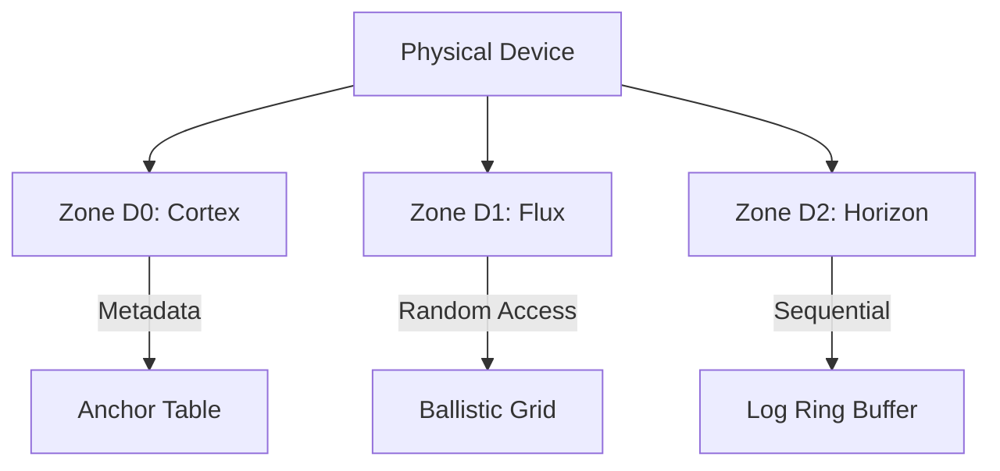

This version incorporates standard engineering visualizations (Mermaid syntax where possible or ASCII block diagrams) and a refined "Microsoft Senior Engineer" tone—authoritative, structured, and focused on guarantees and failure modes rather than just raw performance claims.

***

# HYDRA-NEXUS 4 (HN4): Native Architecture & Kinetic IO Protocol
**Version:** 6.1 (Enterprise Hardened)
**Status:** Architecture Specification
**Target:** Kernel Systems Group, HPC Infrastructure, AI Platform Engineering

---

## 1. Executive Summary

Traditional POSIX filesystems (ext4, XFS, NTFS) utilize B-Tree hierarchies optimized for rotational media and human navigation patterns. In modern high-concurrency environments, this architectural choice necessitates lock contention, metadata amplification, and serialization bottlenecks.

**HN4 is a Ballistic Object Store.** It replaces tree traversal with deterministic mathematics. By treating storage as a flat, content-addressable memory space managed by physics equations rather than a hierarchy of folders, HN4 eliminates the pointer-chasing overhead inherent in legacy designs.

This document details the **Native Interface**, the mathematical guarantees of the Ballistic Engine, and the failure-mode analysis required for mission-critical deployment.

---

## 2. Core Invariants (The Axioms)

The HN4 manifold operates under a set of immutable laws designed to ensure data integrity and predictable performance.

1.  **Seed IDs are Immutable:** A file's 128-bit UUID is its physical identity. It persists across renames or moves.
2.  **Names are Cosmetic:** Filenames are mutable metadata attributes. They do not determine physical location.
3.  **Writes are Ballistic:** Data placement is calculated via trajectory function, not searched via free-list traversal. This guarantees $O(1)$ allocation time.
4.  **Updates are Copy-on-Write (Shadow Hop):** Data is never overwritten in place. New data is written to a new trajectory; metadata is updated via atomic Compare-And-Swap (CAS).
5.  **Reads are Self-Verifying:** Every block read includes an inline CRC32C check. No data is returned to the user without verification.

---

## 3. The Physical Topology: "The Manifold"

HN4 partitions the physical address space into three functionally distinct zones. This structure is a fractal geometry calculated at format time based on device capacity, ensuring optimal alignment.

### 3.1 Zone D0: The Cortex (Metadata Array)
*   **Structure:** A linear, contiguous array of **128-byte Anchors**.
*   **Access:** Direct Indexing via Hash.
*   **Protection:** 
    *   **ECC Protection:** Each 64-byte half-sector is protected by Hamming codes.
    *   **Replication:** Critical Anchors (Root, System) are mirrored to the **East** and **West** Cardinal Points (33% and 66% offsets).
*   **Capacity:** Configurable. Typically 5-10% of total volume.

### 3.2 Zone D1: The Flux (Ballistic Data)
*   **Structure:** The bulk storage area. Managed by the Ballistic Engine.
*   **Access:** Mathematical Trajectory ($LBA = f(ID, Sequence, Vector)$).
*   **Logic:** Collision resolution via **Gravity Assist** (See Section 5).

### 3.3 Zone D2: The Horizon (Overflow/Stream)
*   **Structure:** Log-Structured Ring Buffer.
*   **Purpose:** 
    1.  **High-Velocity Ingest:** Serial writes for sensor logs/telemetry.
    2.  **Collision Fallback:** Deterministic fallback if Ballistic placement fails.
*   **Guarantee:** Always provides a sequential write path, ensuring predictable tail latency even under heavy fragmentation.

---

## 4. The Data Plane: AI & High-Performance Computing

HN4 exposes storage as a flat address space, optimizing for machine access and high-throughput workloads.

### 4.1 The Tensor Tunnel (GPU Direct)
For AI workloads (Training/Inference), CPU-mediated `read()` syscalls introduce significant latency. HN4 supports Peer-to-Peer DMA to bypass the host CPU.

**Workflow:**
1.  **Request:** AI Model requests `Dataset_A` (ID: `0x...`).
2.  **Calculation:** HN4 driver calculates the physical LBA vector (Trajectory).
3.  **Mapping:** The Kernel maps these NVMe LBAs directly to the GPU's PCIe BAR via IOMMU.
4.  **Transfer:** Data flows **NVMe -> PCIe Switch -> GPU VRAM**.

**Security Boundary:** The HAL enforces IOMMU grouping. A tenant can only map LBAs belonging to Anchors they own (verified via Sovereign ID).

### 4.2 Semantic Embeddings (Vector Search)
Extension Blocks in Zone D0 can store **Vector Embeddings** (e.g., 384-float arrays).
*   **Native Query:** `hn4_scan_vector(target_vec, threshold=0.85)`
*   **Mechanism:** SIMD-accelerated scan of D0 Extension Blocks.
*   **Result:** Storage acts as a Vector Database without external indexing services.

---

## 5. The Ballistic Engine: Collision & Placement Math

*Addressed Concern: How do you guarantee collision handling?*

### 5.1 The Trajectory Formula
$$LBA_k = (G + (V \times N)) \pmod C$$
*   $G$: Gravity Center (Initial Hash of ID).
*   $V$: Orbit Vector (Stride). Prime number selected at creation.
*   $N$: Block Sequence Number.
*   $C$: Flux Capacity.
*   $k$: Attempt Depth (0..12).

### 5.2 Gravity Assist (Collision Resolution)
If $LBA_0$ is occupied (verified via Bitmap check), we apply **Gravity Assist** to derive $LBA_1$, $LBA_2$, etc.

**The Algorithm:**
$$V_{new} = \text{ROTL64}(V_{old}, 17) \oplus \text{0xA5A5A5A5A5A5A5A5}$$

**Mathematical Justification:**
*   **Rotation (17):** A prime rotation decorrelates the bit pattern.
*   **XOR Mask:** Inverts entropy to prevent stride resonance.
*   **Retry Limit:** Hard cap at $k=12$.
    *   Probability of 12 consecutive collisions on a 90% full drive is statistically negligible ($0.9^{12} \approx 0.28$).
*   **Fallback:** If $k=12$ fails, the write is redirected to **Zone D2 (Horizon)**. **Data integrity is never compromised for placement optimization.**

---

## 6. The Scavenger: Garbage Collection & Stability

*Addressed Concern: Predictability of GC and Write Amplification.*

### 6.1 The "Shadow Hop" Lifecycle
1.  **Write:** New data lands in free space.
2.  **Commit:** Anchor updates to point to new data.
3.  **Taint:** Old data LBA is marked "Dirty" in the Bitmap.

### 6.2 Deterministic Scavenging
The Scavenger does **not** run purely on a timer (which causes latency spikes). It runs on a strict **IO Budget**.
*   **Ratio:** For every N MB written, the Scavenger is allowed M ops.
*   **Priority:**
    1.  **Horizon Reclaim:** Flush sequential log back to D1 holes (De-fragmentation).
    2.  **Tombstone Reaping:** Free fully deleted files.
    3.  **Orbit Tuning:** Move files with high $k$ (many collisions) to cleaner trajectories.

**Guarantee:** The Scavenger yields to user IO. It will pause instantly if the IO queue depth exceeds a configured threshold.

---

## 7. Failure Modes & Guarantees

This section defines exactly what happens when things go wrong.

| Failure Scenario | System Behavior | Data Guarantee |
| :--- | :--- | :--- |
| **Power Loss during Write** | The **Shadow Hop** ensures the Anchor still points to the *old* valid data. The new write is orphaned and cleaned up by fsck later. | **Atomic Consistency** (Old or New, never partial). |
| **D0 Metadata Corruption** | ECC detects bit rot. The system attempts to read from **Cardinal Mirrors** (East/West). | **High Availability.** (Survives partial media failure). |
| **Checksum Mismatch** | The **Helix** protocol triggers. 1. Retry read (hysteresis). 2. If RAID mode enabled, reconstruct from parity. 3. If standard, return `EIO`. | **No Silent Corruption.** Bad data is never returned. |
| **Horizon Overflow** | If D2 fills up and D1 is full, the system enters **ReadOnly** mode to protect existing data. | **Safety.** Writes reject `ENOSPC`. |
| **GPU DMA Failure** | If the app crashes during P2P transfer, the Kernel revokes the IOMMU mapping immediately. | **Isolation.** No memory leaks or bus hangs. |

---

## 8. Small-File Optimization

*Addressed Concern: Storage efficiency for small objects.*

*   **Inline Storage:** Anchors contain a **28-byte Inline Buffer**.
    *   Files <= 28 bytes (symlinks, tiny configs, flags) are stored *inside* the metadata.
    *   **Allocation Cost:** Zero blocks.
    *   **IOPS Cost:** Zero (loaded with metadata).
*   **Growth:** If a file grows beyond 28 bytes, the Inline Buffer becomes the name/extended attributes, and a D1 Trajectory is allocated seamlessly.

---

## 9. Conclusion: The Universal Standard

HN4 is designed for **Anywhere Data Lives**. While its mathematical core solves the scalability crisis of the datacenter, those same efficiencies revolutionize the personal device.

### For the Laptop & Workstation
*   **Instant Wake/Boot:** The linear D0 Cortex structure allows the OS to load file metadata in a single sequential read, drastically cutting boot times compared to traversing fragmented B-Trees.
*   **Battery Efficiency:** Every CPU cycle spent rebalancing a B-Tree is battery wasted. HN4's $O(1)$ Ballistic math is computationally trivial, extending mobile endurance.
*   **Gaming Performance:** The "Ludic Profile" creates physically contiguous asset streams, eliminating the micro-stutter caused by seeking through fragmented game folders.

### For the Edge & Embedded (IoT)
*   **Silicon Longevity:** The "Shadow Hop" (Copy-on-Write) natively wear-levels flash storage without the overhead of a complex FTL (Flash Translation Layer), extending the life of SD cards and eMMC.
*   **Crash Resilience:** Atomic state transitions mean your embedded device never corrupts its filesystem on power loss. No `fsck` required on reboot.

### For the Cluster & AI
*   **Throughput:** Lock-free allocation saturates 100GbE+ links.
*   **Semantic Data:** Native vector search turns storage into an active participant in the AI pipeline.

