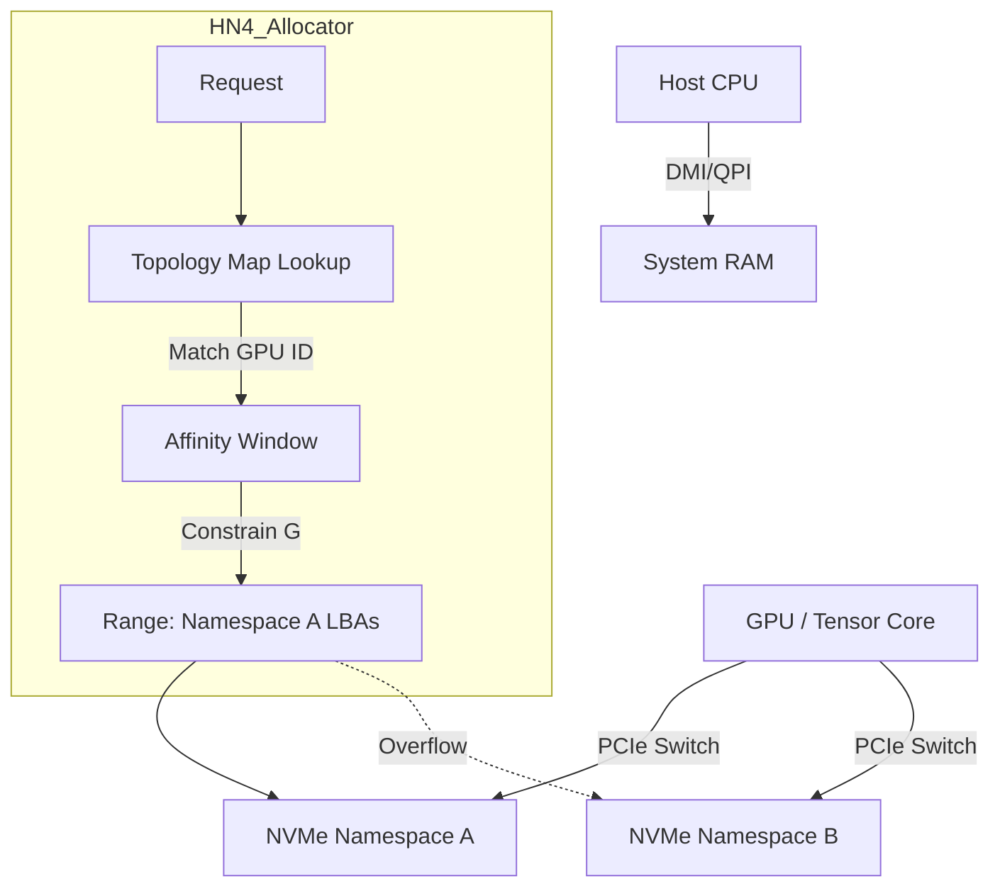

# MATHEMATICAL ARCHITECTURE OF HN4
**Specification:** Algorithmic Data Placement Principles
**Revision:** v18.0 | **Domain:** Discrete Mathematics / Finite Field Arithmetic

---

## 1. Introduction: Algorithmic Placement

In conventional filesystems (B-Tree/Extent based), data location is arbitrary; it is stored wherever the allocator finds free space, and that location is recorded in a metadata tree. To locate data, the system must traverse this tree.

**HN4 uses deterministic placement.**

In HN4, the location of data is calculated mathematically. Given a file's **Base Offset** ($G$) and its **Stride Vector** ($V$), the system calculates the physical location of any logical block $N$ without traversing allocation tables.

The filesystem functions as a **Deterministic Mapping Function** rather than a directory structure.

---

## 2. The Addressing Function

The physical Logical Block Address ($LBA$) for a given logical offset $N$ is calculated via the **Linear Congruential Generator (LCG)** logic found in `_calc_trajectory_lba`:

$$ LBA(N, k) = LBA_{start} + \left( \left[ \frac{G}{S} + (N \times V) + \Theta(k) \right] \pmod \Phi \right) \times S + (G \pmod S) $$

### 2.1 Variable Definitions

| Variable | Code Equivalent | Domain | Description |
| :--- | :--- | :--- | :--- |
| **$G$** | `gravity_center` | $\mathbb{Z}_{2^{64}}$ | The random seed/base offset chosen at file creation. |
| **$N$** | `logical_idx` | $\mathbb{Z}_{\infty}$ | The logical block index of the file ($0, 1, 2 \dots$). |
| **$V$** | `orbit_vector` | $\mathbb{Z}_{2^{48}}$ | The **Stride**. Must be an odd integer relative to $\Phi$ (Coprime). |
| **$\Theta(k)$**| `theta` | $f(k)$ | Non-linear offset for collision retry attempts ($k=0\dots12$). |
| **$\Phi$** | `phi` | $\mathbb{Z}$ | The allocation window size (Total Capacity / $S$). |
| **$S$** | `1 << M` | $2^M$ | **Fractal Scale**: Physical size of one allocation unit (e.g., 4KB, 64KB). |

---

## 3. Allocation Safety Invariants

These mathematical properties are enforced by the kernel (`hn4_alloc_genesis` and `hn4_mount`). Violating them compromises the determinism of the storage engine.

### 3.1 Invariant #1: Coprimality (Full Coverage)
$$ \gcd(V, \Phi) \equiv 1 $$

The Stride $V$ and Window Size $\Phi$ must share no common factors.
*   **Technical Rationale:** This guarantees the generator creates a cyclic group of order $\Phi$. Every physical block in the window is mathematically reachable by the sequence.
*   **Implementation:** `_gcd(V, win_phi)` in `hn4_allocator.c`. If GCD is not 1, the allocator perturbs $V$ (adds 2) until coprimality is achieved.

### 3.2 Invariant #2: Alignment (Fractal Integrity)
$$ G \equiv 0 \pmod S $$

The Base Offset must align to the Block Scale ($S$).
*   **Technical Rationale:** Prevents allocation units from straddling physical erase block boundaries or sector alignments.
*   **Implementation:** `uint64_t g_aligned = G & ~(S - 1);`

### 3.3 Invariant #3: Bijective Mapping
The function $f(N) = (G + N \cdot V) \pmod \Phi$ implies a one-to-one mapping between logical index $N$ and physical index within the domain $\Phi$.
*   **Technical Rationale:** Ensures distinct logical blocks within a file never resolve to the same physical location.
*   **Constraint:** If the volume is resized (changing $\Phi$), existing mappings become invalid. Resizing requires a full migration.

### 3.4 Invariant #4: ECC Authority
The in-memory allocation bitmap (`void_bitmap`) is protected by SECDED (Hamming Code).
*   **Rule:** The allocator operates on the ECC-corrected value, not the raw memory read.
*   **Logic:** `_ecc_check_and_fix` verifies data before any bit test/set operation.

### 3.5 Invariant #5: Saturation Fallback
When the Primary Region (D1) is saturated, the system must switch allocation strategies.
*   **Threshold:** >90% Capacity (`_check_saturation`).
*   **Mechanism:** When collision probability exceeds efficiency limits, the allocator falls back to the **Overflow Log** (Horizon/D1.5), which uses a simple linear ring buffer ($V=0$).

---

## 4. Collision Resolution & Entropy

When a calculated $LBA$ is already allocated (Collision), HN4 uses **Vector Perturbation** rather than linear probing to avoid clustering.

### 4.1 Vector Perturbation (Gravity Assist)
If primary placement attempts ($k=0\dots3$) fail, the Stride Vector $V$ is mutated to find a new trajectory:

$$ V_{new} = \text{ROTL}_{64}(V_{old}, 17) \oplus \text{0xA5A5A5A5A5A5A5A5} $$

*   **Implementation:** `hn4_swizzle_gravity_assist` in `hn4_swizzle.c`.
*   **Logic:** A 17-bit rotation (prime number) combined with a 50% bit-flip pattern decorrelates the new stride from the original, jumping out of local congestion.

### 4.2 Modular Addition Mixing
The implementation uses modular addition rather than XOR for offset calculation to preserve uniformity in the Finite Field $\mathbb{Z}_{\Phi}$.

```c
/* hn4_allocator.c: _calc_trajectory_lba */
uint64_t offset = _mul_mod_safe(term_n, term_v, phi);
offset = (offset + entropy_loss) % phi;
```

### 4.3 Collision Offset ($\Theta$) Rules
The collision offset $\Theta(k)$ (Jitter) varies by hardware topology to optimize seek patterns.

| Profile | $\Theta(k)$ Behavior | Rationale |
| :--- | :--- | :--- |
| **SSD / NVM** | Active ($k \ge 4$) | **Scatter:** Distributes writes across NAND channels/dies. |
| **AI / Tensor** | Active ($k \ge 4$) | **Load Balancing:** Avoids hotspots on specific NVMe namespaces. |
| **HDD / Tape** | **ALWAYS 0** | **Linearity:** Forces sequential access to minimize head seek latency. |
| **ZNS** | **ALWAYS 0** | **Append-Only:** Random offsets are illegal in Zoned Storage. |

---

## 5. Metadata-Based Reconstruction

HN4 supports **O(F) Recovery** (where F is the number of files), distinct from O(N) block scanning.

Given the tuple $\{G, V, M, \Phi\}$ stored in the Anchor (Inode), the kernel can mathematically re-calculate the physical location of every block belonging to that file.

1.  **Load:** The system reads the Anchor Table (Cortex).
2.  **Projection:** For every valid Anchor, `_reconstruct_cortex_state` calls `_calc_trajectory_lba` for $N=0 \dots \text{Size}$.
3.  **Restoration:** The calculated LBAs are marked as "Allocated" in the in-memory bitmap.
4.  **Result:** The allocation map is rebuilt without reading the data blocks themselves.

---

## 6. Failure Modes & Safety

The system handles mathematical and hardware exceptions deterministically.

### Case A: ECC DED (Uncorrectable Error)
*   **Event:** RAM corruption in the allocation bitmap exceeds 2 bits.
*   **Code:** `HN4_ERR_BITMAP_CORRUPT`.
*   **Action:** Volume transitions to `HN4_VOL_PANIC`. Writes suspended to prevent data corruption.

### Case B: Ghost Allocation (Bitmap Desync)
*   **Event:** A block is marked "Free" in the bitmap, but `_verify_block_at_lba` finds valid data with a matching UUID.
*   **Action:** The "Shadow Write" logic detects the collision.
    *   **Recovery:** The allocator picks a new trajectory. The "Ghost" block is left orphaned (to be reclaimed by `hn4_scavenger` later) or overwritten if explicitly validated as stale.

### Case C: Geometry Mismatch
*   **Event:** Volume resized ($\Phi$ changed) without a re-format.
*   **Detection:** `hn4_mount` checks $\gcd(V, \Phi_{new})$.
*   **Action:** Mounts **Read-Only**.
*   **Reason:** The math relies on modulo $\Phi$. Changing $\Phi$ invalidates all existing $LBA$ calculations.

### Case D: Topology Change (AI Affinity)
*   **Event:** GPU ID in `topo_map` no longer exists (hardware removed).
*   **Action:** `_get_ai_affinity_bias` returns `false`.
*   **Result:** Allocator falls back to global placement (standard CPU path). Functionality is preserved; locality optimization is lost.

---

## 7. Complexity Analysis

| Operation | Complexity | Notes |
| :--- | :--- | :--- |
| **Primary Allocation** | $O(1)$ | 1 calculation + 1 atomic CAS. |
| **High Load Allocation** | $O(K)$ | Bounded by $K_{max}=12$ retries. |
| **Overflow Allocation** | $O(1)$ | Linear increment (Horizon log). |
| **Read Lookup** | $O(1)$ | Direct math calculation. No tree traversal. |
| **Recovery** | $O(F)$ | Scans Files ($F$), not Blocks ($N$). |

*   **Write Amplification:** ~1.0 (Metadata is updated asynchronously via the Anchor, not per-block).

---

## 8. Security Considerations

*   **Predictability:** Because locations are mathematical, an attacker with read access to the Anchor ($G, V$) can calculate where file data is stored physically.
    *   **Mitigation:** `HN4_HINT_ENCRYPTED` encrypts the Anchor payload, hiding the seed parameters.
*   **Inference Attacks:** Observing sequential write patterns could reveal $V$.
    *   **Mitigation:** The **Vector Perturbation** (Gravity Assist) injects non-linear jumps, masking the stride pattern.

---

## 9. Topology-Aware Allocation

The allocator uses hardware topology to route data to the optimal physical media (e.g., placing data on the flash chip closest to the requesting GPU).



1.  **Request:** `hn4_alloc_genesis` detects the calling thread's bound GPU ID.
2.  **Lookup:** Checks `vol->topo_map` for that ID.
3.  **Constraint:** The random selection of $G$ (Base Offset) is constrained to the LBA range defined for that NUMA node/Namespace.
4.  **Result:** Data is written to the device physically attached to the accelerator, enabling Peer-to-Peer (P2P) DMA.

---

## Appendix A: Mathematical Proof of Coverage

**Theorem:** If $\gcd(V, \Phi) = 1$, then the mapping function $f(n) = (n \times V) \pmod \Phi$ generates a permutation of the set $\mathbb{Z}_\Phi$.

**Proof Summary:**
1.  Assume two distinct inputs $x, y$ where $0 \le x < y < \Phi$.
2.  If a collision occurs, then $(x \times V) \equiv (y \times V) \pmod \Phi$.
3.  This implies $V(x - y) \equiv 0 \pmod \Phi$.
4.  Since $\gcd(V, \Phi) = 1$, $V$ has a modular multiplicative inverse. We can divide by $V$.
5.  This implies $(x - y) \equiv 0 \pmod \Phi$, which means $x \equiv y \pmod \Phi$.
6.  This contradicts the assumption that $x \ne y$ within the domain.
7.  Therefore, the map is injective (one-to-one) and surjective (onto), ensuring every block $0 \dots \Phi-1$ is visited exactly once in the sequence.
