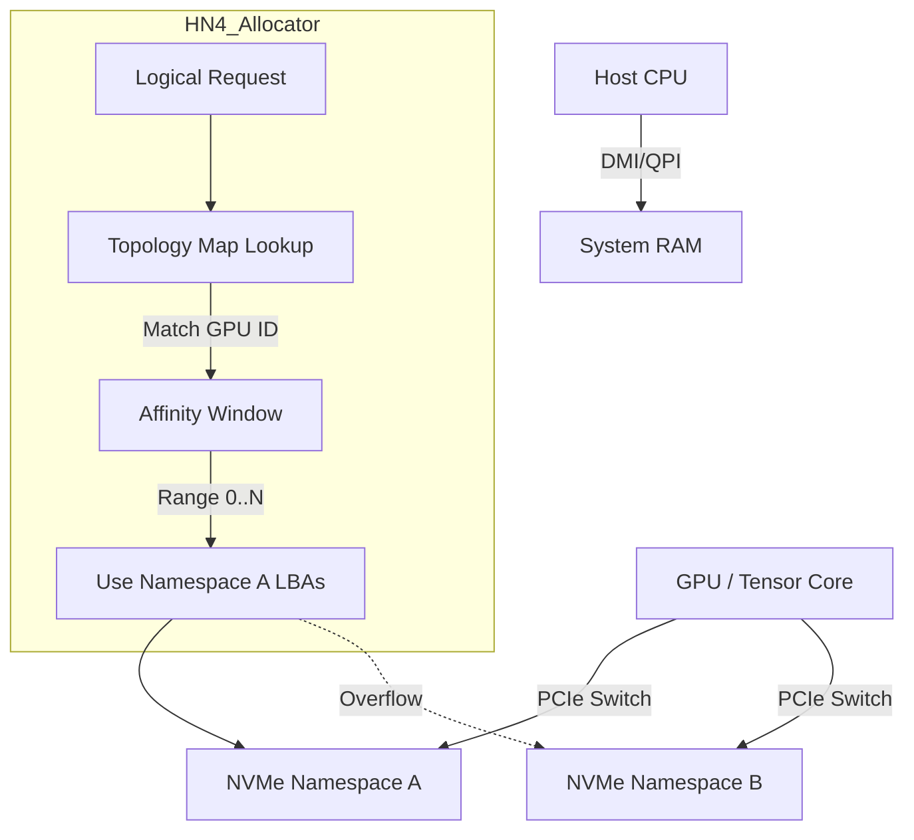

# THE MATHEMATICS OF HYDRA-NEXUS 4
**Architecture Specification: Mathematical Principles**
**Revision:** v18.0 | **Domain:** Discrete Mathematics / Finite Fields

---

## 1. Introduction: The Function is the Filesystem

In conventional filesystems (B-Tree based), the location of a file's data is arbitrary; it is stored wherever the allocator found a hole, and that location is recorded in a metadata tree. To find the data, you must traverse the tree. This scales poorly as capacity and fragmentation increase.

**HN4 inverts this reality.**

In HN4, the location of data is **deterministic**. If you know the file's "Gravity Center" ($G$) and its "Orbit Vector" ($V$), you can mathematically calculate the physical location of any block $N$ without reading any metadata tables.

**Traditional filesystems store the answer.**
**HN4 stores the question — and recomputes the answer forever.**

The filesystem is not a data structure; it is a **Ballistic Trajectory Function**.

---

## 2. The Universal Trajectory Function

The physical Logical Block Address ($LBA$) for any given logical offset $N$ is calculated via the **Equation of State**:

$$ LBA(N, k) = LBA_{flux} + \left( [ G + (N \times V \times 2^M) + \Theta(k) ] \pmod \Phi \right) \times S $$

### 2.1 Variable Definitions

| Variable | Name | Domain | Description |
| :--- | :--- | :--- | :--- |
| **$G$** | Gravity Center | $\mathbb{Z}_{2^{64}}$ | The random seed chosen at file creation. The "home" coordinate. |
| **$N$** | Sequence | $\mathbb{Z}_{\infty}$ | The logical block index of the file ($0, 1, 2 \dots$). |
| **$V$** | Orbit Vector | $\mathbb{Z}_{2^{48}}$ | The "stride" or angle of the trajectory. **Must be Coprime to $\Phi$.** |
| **$\Theta(k)$**| Collision Theta | $f(k)$ | Non-linear offset for retry shells ($k=0\dots12$). |
| **$\Phi$** | Fractal Capacity | $\mathbb{Z}$ | Total available groups of size $S$ on the volume. |
| **$S$** | Scale Factor | $2^M$ | Physical size of one allocation unit (e.g., $2^0=4\text{KB}, 2^4=64\text{KB}$). |

---

## 3. Allocator Safety Invariants (The Law)

These mathematical properties are non-negotiable. They are enforced by the kernel at Mount and Genesis. Violating them corrupts the volume logic.

### 3.1 Invariant #1: Coprimality (Coverage)
$$ \gcd(V, \Phi) \equiv 1 $$

The Orbit Vector $V$ and Volume Capacity $\Phi$ must share no common factors.
*   **Why:** This guarantees the trajectory generates a cyclic group of order $\Phi$. Every block is reachable.
*   **Violation Effect:** Resonance Loops. The file wraps around prematurely, accessing only a fraction of the disk (e.g., if $\gcd=4$, only 25% of blocks are reachable).
*   **Enforcement:** Verified at Genesis via Euclidean Algorithm. Re-verified at Mount if volume geometry changed.

### 3.2 Invariant #2: Alignment Preservation (Fractal Integrity)
$$ G \equiv 0 \pmod S $$

The Gravity Center must align to the Fractal Scale.
*   **Why:** Prevents "Fractal Fragmentation" where a large-block allocation ($S=16$) straddles the boundary of physical erase blocks.
*   **Enforcement:** Bitwise masking during seed generation: `G & ~(S - 1)`.

### 3.3 Invariant #3: Orbit Injectivity (Uniqueness)
The mapping function $f(N) = (G + N \cdot V) \pmod \Phi$ must be bijective over the domain $N \in [0, \Phi-1]$.
*   **Why:** Ensures two different logical blocks $N_1 \ne N_2$ never map to the same physical location (collision within the same file).
*   **Implication:** If the volume shrinks (changing $\Phi$), existing trajectories become invalid. Resizing requires a full remap (Wormhole Transfer).

### 3.4 Invariant #4: SECDED Authority
The allocator state in RAM is protected by Hamming Code.
*   **Law:** The allocator trusts the ECC-corrected value, not the raw memory read.
*   **Logic:** `if (ECC_Syndrome != 0) { Correct(); WriteBack(); UseCorrected(); }`.

### 3.5 Invariant #5: Saturation Mode Switching
Switching to the Horizon Ring is mathematically required, not a heuristic.
*   **Trigger:** $\rho > 0.90$ (Occupancy).
*   **Why:** At 90% density, the probability of collision in the ballistic domain exceeds efficiency thresholds ($P_{fail} > 12\%$). To preserve $O(1)$ latency, the system MUST switch to the deterministic linear log (Horizon).

---

## 4. Entropy & Gravity Assist

When an allocation collision occurs (the calculated $LBA$ is occupied), HN4 does not simply linear probe ($+1$). Linear probing causes **Primary Clustering**. Instead, HN4 uses **Gravity Assist** (Non-Linear Hashing).

### 4.1 The Gravity Shift Function
If primary orbits ($k=0\dots3$) are blocked, $V$ is mutated:

$$ V_{new} = \text{ROTL}_{64}(V_{old}, 17) \oplus \text{0xA5A5A5A5A5A5A5A5} $$

1.  **Bitwise Rotation (17):** 17 is prime. Diffuses bits across the word.
2.  **XOR Constant (`0xA5...`):** Flips 50% of bits, inverting probability distribution.

### 4.2 Mixing Entropy (Reversibility)
Trajectory calculation uses Modular Addition to preserve uniformity:

```c
/* Correct Modular Addition Mixing */
offset = (_mul_mod_safe(N, V, Phi) + EntropyLoss) % Phi;
```

*   **Why Add?** Addition is an isomorphism in $\mathbb{Z}_n$. It preserves the uniform distribution.
*   **Why Not XOR?** XOR is not structure-preserving in Modulo arithmetic.

### 4.3 $\Theta(k)$ Domain Rules
The collision offset $\Theta(k)$ behavior depends on the hardware profile:

| Profile | $\Theta(k)$ Behavior | Rationale |
| :--- | :--- | :--- |
| **SSD / NVM** | Active for $k \ge 4$ | Maximizes entropy to find holes. Random I/O is cheap. |
| **AI / Tensor** | Active for $k \ge 4$ | Avoids local congestion near GPU ingress points. |
| **HDD / Tape** | **ALWAYS 0** | **Inertial Damping.** Prevents head thrashing. If $k=0$ fails, go to Horizon. |
| **ZNS** | **ALWAYS 0** | Random writes are illegal. Must append or fail. |

---

## 5. Deterministic Reconstructability

HN4 provides a unique property: **Zero-Scan Reconstruction**.

Given the tuple $\{G, V, M, \Phi\}$ from an Anchor, the kernel can deterministically re-enumerate every physical block location in logical sequence order without reading block headers.

1.  **Recovery:** If the allocation bitmap is corrupted, the kernel reads the Cortex (Anchor Table).
2.  **Projection:** For every valid Anchor, it calculates the trajectory $LBA(0 \dots N)$.
3.  **Restoration:** It marks those calculated LBAs as "Used" in a fresh bitmap.
4.  **Verification:** Since $V$ is coprime, the mapping is injective. No two files can mathematically claim the same block unless a collision occurred at write time (which the bitmap prevents).

This turns the filesystem recovery from an $O(N)$ scan of all blocks into an $O(F)$ scan of files, which is orders of magnitude faster.

---

## 6. Failure & Adversarial Analysis

The system is designed to fail safely under stress.

### Case A: ECC DED Event (Double Bit Error)
*   **Event:** RAM corruption exceeds 1 bit per word.
*   **Action:** Allocator halts. Volume marked `HN4_VOL_PANIC`.
*   **Why:** We cannot trust the free-space map. Writing might overwrite data.
*   **Recovery:** Requires offline scrub (fsck) or remount.

### Case B: Bitmap Corruption (False Free)
*   **Event:** Bit flips to 0 (Free) when it should be 1 (Used).
*   **Action:**
    *   **Allocation:** Allocator claims it. Shadow Write logic writes data.
    *   **Commit:** Metadata update points to new block.
    *   **Result:** Data is safe. Old data at that block is overwritten, but since the bitmap thought it was free, no *active* file should point there (unless split-brain).
    *   **Safety:** The `_bitmap_op` clamp prevents counter underflow, ensuring global stats don't wrap to infinity.

### Case C: Coprime Violation (Geometry Shift)
*   **Event:** Volume resized ($\Phi$ changed) without remap.
*   **Action:** `hn4_mount` detects $\gcd(V_{stored}, \Phi_{new}) \ne 1$.
*   **Result:** Mounts as **Read-Only**.
*   **Why:** Writing new blocks with the wrong modulus would break file contiguity and make data unreachable.

### Case D: AI Affinity Map Change
*   **Event:** GPU removed or PCIe topology changed.
*   **Action:** Allocator detects invalid GPU ID in Topology Map.
*   **Result:** Fallback to **Global Allocation** (CPU path).
*   **Impact:** Performance degrades (NUMA miss), but correctness is preserved.

---

## 7. Performance Asymptotics

| State | Complexity | Description |
| :--- | :--- | :--- |
| **Flux (Empty)** | $O(1)$ | 1 Probe. Immediate success. |
| **Flux (75%)** | $O(1)$ | Avg 1.3 Probes. |
| **Flux (90%)** | $O(K)$ | Avg 2-5 Probes. Bounded by $K=20$. |
| **Horizon** | $O(1)$ | 1 Atomic Increment. No probing. |
| **Recovery** | $O(F)$ | Linear scan of Anchors (Files), not Blocks. |

*   **Write Amplification:** Near 1.0 (No metadata tree updates per block).
*   **Locality:**
    *   HDD: High (Warm Locality bias).
    *   SSD: Low (Entropy scatter for wear leveling).

---

## 8. Security & Side-Channels

*   **Determinism Risk:** Since locations are mathematical, an attacker knowing $\{G, V\}$ can predict where file data resides.
*   **Mitigation:** $G$ and $V$ are stored in the Anchor. If the Cortex (Metadata) is encrypted (`HN4_HINT_ENCRYPTED`), the trajectory parameters are hidden.
*   **Inference:** Observing write patterns might reveal $V$.
    *   *Defense:* Gravity Assist injects non-linear jumps, making simple stride analysis difficult without the full bitmap state.

---


## 9. AI Topology Architecture

How the allocator routes Tensor data to the correct flash chips:



1.  **Request:** Thread on GPU 0 requests allocation.
2.  **Lookup:** Allocator sees GPU 0 is "Distance 1" from Namespace A.
3.  **Window:** Allocator restricts $G$ selection to the LBA range of Namespace A.
4.  **Result:** DMA transfer happens directly via PCIe Switch (P2P), bypassing CPU RAM.

---

## Appendix A: Proof of Coverage (Sketch)

**Theorem:** If $\gcd(V, \Phi) = 1$, then the map $f(n) = nV \pmod \Phi$ is a permutation of $\mathbb{Z}_\Phi$.

**Proof:**
We must show the map is injective (one-to-one).
Assume there exist two distinct indices $x, y \in \{0, \dots, \Phi-1\}$ such that:
$$ xV \equiv yV \pmod \Phi $$
$$ (x - y)V \equiv 0 \pmod \Phi $$

Since $\gcd(V, \Phi) = 1$, $V$ has a modular multiplicative inverse $V^{-1}$.
Multiply both sides by $V^{-1}$:
$$ (x - y) \equiv 0 \pmod \Phi $$
$$ x \equiv y \pmod \Phi $$

Since $x, y < \Phi$, this implies $x = y$.
This contradicts the assumption that $x$ and $y$ are distinct.
Therefore, the map is injective.
Since the domain and codomain are finite and equal size, an injective map is also surjective (onto).
Thus, the trajectory visits every element in the set exactly once. **Q.E.D.**
