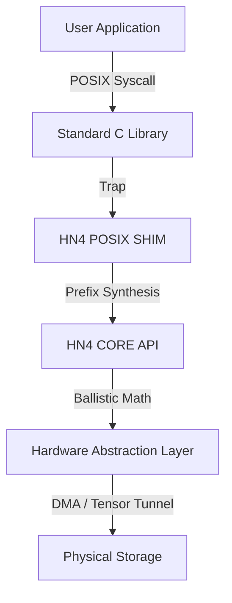

# HN4 POSIX Shim: The Compatibility Bridge
**Version:** 7.3 (Hardened / Enterprise)  
**Component:** Virtual File System (VFS) Translation Layer  
**Architect:** Kernel Systems Group

---

## 1. Executive Summary
The **HN4 POSIX Shim** is a zero-copy translation layer that maps legacy syscalls (`open`, `read`, `ls`) onto the **Hydra-Nexus 4 (HN4)** Ballistic Object Store.

Because HN4 is a flat-space, mathematical manifold without inodes or directory trees, the Shim performs **Real-Time Structural Synthesis**. It hallucinates a POSIX-compliant hierarchy on top of a deterministic hash table.

**The Trade-off:** We sacrifice specific metadata write-latencies (like directory renames) to achieve **O(1) File Access** and **Maximum Read Throughput**.

---

## 2. The Architectural Stack



---

## 3. The Grand Illusion: Synthetic Directories

The most complex task of the Shim is **The Name Illusion**. HN4 stores files as a flat list of 128-byte Anchors in the D0 Cortex. There are no directory blocks on disk.

### 3.1 The "Flash-Bang" Scan (`readdir`)
When `ls -la /photos` runs, the Shim does not traverse a tree. It scans the Cortex.

**The Scalability Strategy (Addressing the Linear Scan Concern):**
Critics often fear linear scanning at scale (billions of files). HN4 mitigates this via **Hardware-Assisted Skip Logic**:

1.  **L2 Summary Skip:** The `l2_summary_bitmap` tracks which 4KB Cortex blocks are empty. We skip empty regions entirely (Zero-Cost).
2.  **Prefetch Batching:** Anchors are read in 64KB - 2MB chunks (Hardware Dependent).
3.  **SIMD Filter:** The Shim uses AVX/NEON intrinsics to check 4-8 Anchors simultaneously against the path prefix.
    *   *Result:* We scan RAM/Cache at memory bandwidth speeds, not disk seek speeds.

### 3.2 Visualizing the Mapping

**Physical Storage (D0 Cortex - Linear Array):**
| Slot | ID | Filename (String Key) |
| :--- | :--- | :--- |
| 0 | 0xA1 | `"sys/config"` |
| 1 | 0xB2 | `"photos/cat.jpg"` |
| 2 | 0xC3 | `"photos/dog.png"` |

**User View (`ls /photos`):**
```text
.           (Synthesized State 1)
..          (Synthesized State 2)
cat.jpg     (Derived from Slot 1 - Prefix Stripped)
dog.png     (Derived from Slot 2 - Prefix Stripped)
```

---

## 4. Operation Kinetics & Scalability

### 4.1 The Directory Rename Problem (O(N) Complexity)
**The Challenge:** Since directories do not exist, renaming `/photos` to `/images` requires finding *every* Anchor starting with `"photos/"` and rewriting its name string.

**The Mitigation Strategy:**
1.  **Block-Local Batching:** The Shim identifies all affected Anchors within a single 4KB metadata block and updates them in RAM.
2.  **Single Flush:** The block is written to disk *once*, rather than once per file.
3.  **Failure Mode:** If power fails mid-rename, the volume enters a **Split-Brain State** (some files in `/photos`, some in `/images`).
    *   *Recovery:* The Scavenger (fsck) detects this during the next mount and completes the roll-forward based on the Journal (if enabled) or leaves them split (Standard Mode).
    *   *Recommendation:* For atomic moves of millions of files, use **Native Tags**, not POSIX paths.

### 4.2 The Atomic Write Cycle (`pwrite`)
HN4 is lock-free, but POSIX requires atomicity.

1.  **Locking:** Acquire Per-FD Spinlock (Granular).
2.  **Seeking:** `hn4_api_seek(handle, offset)`.
3.  **Submission:** `hn4_api_write(...)`.
    *   Calculates Ballistic Trajectory.
    *   Writes Data to D1 Flux (New Location).
    *   Updates RAM Anchor.
4.  **Commit:** `hn4_api_sync` (Flush Anchor to D0).
5.  **Unlock:** Release Spinlock.

---

## 5. Security & Permission Model

The Shim maps HN4's **Sovereign Capability Model** to POSIX modes.

### 5.1 The Hierarchy of Enforcement
Rules are applied in this strict order. A higher rule overrides lower ones.

| Priority | Rule | Effect |
| :--- | :--- | :--- |
| **1 (Highest)** | **Immutable Bit** | If set, **NO ONE** (even Root) can write or unlink. Must strip bit first. |
| **2** | **Sovereign ID** | Operations requiring ownership must match the Creator Key Hash. |
| **3** | **Root Override** | UID 0 (Root) bypasses Read/Write checks (unless Immutable). |
| **4 (Lowest)** | **Mode Bits** | Standard `RWX` checks apply. |

### 5.2 The `.meta` Security Boundary
The virtual `.meta` directory exposes internal engine stats.
*   **Visibility:** Always visible in root.
*   **Access:** Strictly gated. Reading `.meta/keys` or `.meta/geometry` requires **Root / CAP_SYS_ADMIN**.
*   **Leakage:** No secure internal state (keys, raw vectors) is ever exposed to unprivileged users via the Shim.

---

## 6. Performance Characteristics

### Strengths
*   **O(1) File Open:** Opening `/a/b/c/d/file` does *not* walk 4 directory inodes. It hashes the string once and jumps to the physical location.
*   **Zero-Copy IO:** User buffers are passed directly to the HAL DMA engine.
*   **No Inode Contention:** Creating files in the same "directory" does not lock a directory node. It only claims a slot in the linear table.

### Limitations (The Cost of the Illusion)
*   **Slow `ls` on Exascale:** On a 100PB drive with billions of files, `ls /` scans the whole table.
    *   *Workaround:* Use `hn4_scan_tag()` (Native API) for subset queries.
*   **Hard Links:** Not Supported (`ENOTSUP`). HN4 relies on unique Identity (UUIDv7).
*   **Rename Overhead:** Mass directory moves are expensive.

---

## 7. Example Usage

### Standard POSIX
```c
// Internally: Hash("logs/sys.log") -> Jump to LBA
int fd = open("/logs/sys.log", O_RDWR);

// Internally: Trajectory Calculation -> DMA Write
write(fd, buffer, 4096);
```

### Native Interop (Via Extended Attributes)
Advanced users can bridge POSIX and Native features using `xattr`.

```bash
# Get the Immutable 128-bit Seed ID
getfattr -n user.id /mnt/data/file.txt

# Search via Tag (VFS interprets this path specially)
ls -la /mnt/data/tag:urgent
```